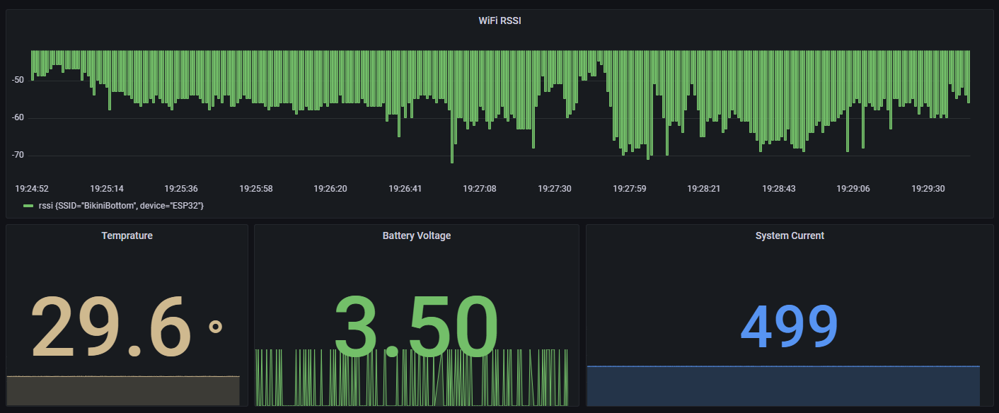

# Smart-Charger-Manager 智能电池管理系统

## 简介

由于物联网终端设备常强调小型化和便携性，所以在物联网设备的使用中，设备的电源常常以电池形式出现，这些电池一般需要在特定时间间隔充电。对于物联网设备的电池工作情况，可以对其进行监控与管理。本项目主要研究物联网设备中常用的3.7V锂充电电池的电池充电，并使用ESP32作为主控制器，使用DS2438Z、TP4056、DW01等芯片完成电池充电、电池保护、电池监测等工作。最终制作并呈现了一个稳定、安全、用户交互良好的物联网电源管理模块。

本项目仅仅作为练手Demo。

## 系统构成

### 电池

3.7V充电锂电池

### 充电模块

电池充电模块采用锂电池充电芯片TP4056，参考开源方案设计。其上面有两个充电指示灯，红灯表示充电中，绿灯表示充电完成，是通过IC的两个信号输出引脚控制灯亮灭来实现的。充电模块可以完全拟合锂电池充电的三个阶段，并且可以通过修改R5来对恒流充电时的电流大小进行修改，以匹配不同的电池容量。另外控制Enable引脚，可以在不切断输入电源的情况下关闭电池的充电。

### 保护模块

电池保护模块使用的是通用锂电池保护芯片DW01和20VN沟道增强型MOS场效应管SC8205.
当过充时：电池保护模块监测锂电池两端的电压，当锂电池电压升高到4.2V时，认为锂电池电压已处于过充电压状态，立即控制充电MOS管截止。停止锂电池的充电，电池充电回路被切断，停止充电。
当过放时：锂电池外接负载进行放电时，锂电池电压将慢慢降低。DW01通过R1电阻检锂电池电压。当电压降低至2.3V时，认为锂电池电压已处于过放电压状态，无电压导致放电MOS管截止，停止放电。

### 监控模块

DS2438Z监控模块是智能电池管理的核心。它的外围电路很简单，VDD连接输入电压，VAD是电压采集端口，可以采集电池实时的电压，而VSENS-与VSENS+是电流采集端口，可以采集电池的输入充电电流和输出电流。其需要配备采样电阻R3并通过计算得到实时的电流值。测量除电源板外系统的工作电流，约为50mA，而选择的采样电阻为8W 0.02Ω，在4.2V的情况下能采超过180mA的电流，满足需求。另外，需要对输入电流进行低通滤波，滤除高频噪声。最后，其使用单线与ESP32进行通信，让其能获取电池信息。

### 控制与交互

- 微控制器：ESP32 MH-ET LIVE
- 屏幕：OLED-SSD1306 MH-ET LIVE套件
- 输入：编码器SIQ-FVS3

### 服务器连接与配置

先在轻量云服务器中运行数据库，存储一定时间期限的数据并且使用api使其能够在前端显示出来（历史数据）。另外，在后台可以看到各组数据，并使用最简单的办法进行可视化。其涉及到多用户管理的部分可以暂时不作考虑（DIY倾向）。
使用了 InfluxDB2.0 + Telegraf + Grafana 进行服务器数据库以及可视化的实现。`main.c`中，包含ESP32 Arduino 直接写入 Database。

